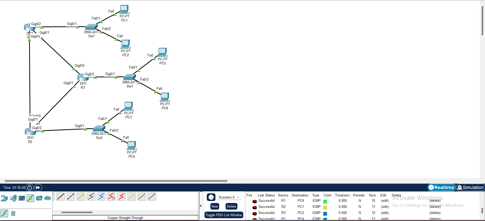

# Cisco Enterprise Network Design Using OSPF

## 📌 Project Overview

This project demonstrates the design and implementation of an enterprise network using Cisco Packet Tracer.

The network uses OSPF (Open Shortest Path First) as a dynamic routing protocol to allow routers to automatically learn and exchange network routes.

## 🖥️ Network Topology

The network consists of three routers connected in a triangular topology, providing multiple paths between routers.

- 3 Cisco Routers
- 3 Cisco Switches
- 6 PCs
- OSPF Area 0
- IPv4 addressing
- Dynamic routing

  

## 🔧 Technologies Used

- Cisco Packet Tracer
- OSPF
- IPv4
- Dynamic Routing
- Cisco IOS
- Ethernet
- Network Troubleshooting

## 🌐 IP Addressing

| Network | Address |
|---|---|
| R1 LAN | 192.168.10.0/24 |
| R2 LAN | 192.168.20.0/24 |
| R3 LAN | 192.168.30.0/24 |
| R1-R2 | 10.0.12.0/30 |
| R1-R3 | 10.0.13.0/30 |
| R2-R3 | 10.0.23.0/30 |

## ⚙️ OSPF Configuration

OSPF Area 0 was configured on all three routers.

Router IDs:

- R1: 1.1.1.1
- R2: 2.2.2.2
- R3: 3.3.3.3

## ✅ Verification

The following commands were used to verify the network:

```text
show ip ospf neighbor
show ip route
show ip interface brief
show ip ospf
